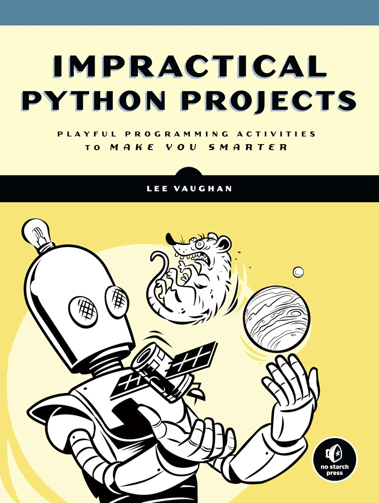

# Impractical Python Projects::
 ### Resolución del Libro.



# Índice

1. [Requisitos](#requisitos)
2. [Modo de uso](#modo-de-uso)
3. [Estructura del Proyecto](#estructura-del-proyecto)
4. [Imágenes](#imágenes)
5. [Archivos Principales](#archivos-principales)
6. [Notas](#notas)
7. [Contacto](#contacto)
8. [Tecnologías utilizadas](#tecnologías-utilizadas)

"Impractical Python Projects" es un libro orientado a los entusiastas de la programación que desean desafiar sus habilidades con proyectos únicos, divertidos y a menudo extravagantes. Es una colección de actividades y retos diseñados para poner a prueba la creatividad, la lógica y la capacidad de resolución de problemas de los lectores.


## Requisitos

Asegúrate de tener Python 3.x instalado y las siguientes bibliotecas requeridas:

- random
- string
- sys
- pprint
- defaultdict


Puedes instalar las dependencias con el siguiente comando:

```
pip install random string sys pprint defaultdict
```

## Modo de uso

### Cómo Inicializar en tu PC.

Para ejecutar esta aplicación en tu máquina local, sigue estos pasos:

1. **Clona este repositorio en tu sistema local.**

    git clone <URL-del-repositorio>
        cd nombre-del-repositorio


2. **Instalar Dependencias:**

    Asegúrate de tener Python y pip instalados. Luego, instala las dependencias necesarias ejecutando:
pip install -r requirements.txt

3. **Ejecutar la Aplicación:**

    Una vez que todas las dependencias estén instaladas, puedes ejecutar la aplicación:

python ###.py (El nombre del archivo que desees abrir)


## Estructura del Proyecto

- Título: Impractical Python Projects: Playful Programming Activities to Make You Smarter
- Autor: Lee Vaughan
- Editorial: No Starch Press
- Publicación: Enero 2019
- Páginas: 424
- ISBN: 978-1-59327-890-8

**Descripción del Libro:**

- "Impractical Python Projects" es un libro orientado a los entusiastas de la programación que desean desafiar sus habilidades con proyectos únicos, divertidos y a menudo extravagantes. Es una colección de actividades y retos diseñados para poner a prueba la creatividad, la lógica y la capacidad de resolución de problemas de los lectores.

- Cada proyecto es una oportunidad para aprender conceptos avanzados de programación en Python de una manera práctica y entretenida. Desde simular la evolución de un virus, hasta descifrar códigos secretos, estos proyectos están diseñados para ser "imprácticos" en el sentido más estimulante de la palabra, enfocándose más en la diversión y el aprendizaje que en la utilidad cotidiana.

- El libro cubre una amplia gama de temas, incluidos algoritmos, simulaciones, inteligencia artificial básica, criptografía, y análisis de datos, todo dentro del contexto de proyectos que son lo suficientemente accesibles para los principiantes, pero lo suficientemente profundos para mantener el interés de los programadores más experimentados.

**Contenido Destacado:**

- Simulaciones: Aprende a crear simulaciones de fenómenos naturales y sociales, como epidemias y dinámicas de mercado.

- Criptografía: Descubre cómo descifrar códigos y mensajes encriptados utilizando diferentes técnicas criptográficas.

- Algoritmos Genéticos: Explora la evolución simulada a través de algoritmos que imitan los procesos de selección natural.

- Juegos y Puzzles: Desarrolla juegos y rompecabezas utilizando algoritmos lógicos y creativos.

- Análisis de Datos: Trabaja con datos reales y aprende a extraer información valiosa mediante técnicas de análisis de datos.

- El enfoque del libro no es solo enseñar Python, sino también fomentar una mentalidad de resolución de problemas y creatividad, haciendo que cada proyecto sea una experiencia de aprendizaje envolvente.

**¿A quién está dirigido?**

"Impractical Python Projects" es ideal para cualquier persona con conocimientos básicos de Python que busque mejorar sus habilidades mientras se divierte con desafíos interesantes. Ya seas un estudiante, un programador autodidacta o un profesional buscando un enfoque diferente para practicar tus habilidades, este libro te ofrecerá horas de entretenimiento y aprendizaje valioso.

El repositorio cuenta con carpetas, en las cuales se encuentran los proyectos de manera separada:

[**1. Silly Name Generator**](./1_Silly_name_generator)

**Pseudonyms:**

- Genera aleatoriamente nombres graciosos para compañeros usando código Python que se ajuste a las directrices de estilo establecidas.
**

**Pig latin:**

- Para formar el pig latin, se toma una palabra inglesa que comienza con una consonante,
se mueve esa consonante al final y luego se agrega “ay” al final de la palabra.
Si la palabra comienza con una vocal, simplemente se agrega “way” al final de la
palabra. Una de las frases en pig latin más famosas de todos los tiempos es “ixnay on the
ottenray”, pronunciada por Marty Feldman en la obra maestra cómica de Mel Brooks
El joven Frankenstein.


Escriba un programa que tome una palabra como entrada y utilice indexación y
slicing para devolver su equivalente en Pig Latin. Ejecute Pylint y pydocstyle en
su código y corrija cualquier error de estilo. Puede encontrar una solución en el
apéndice o descargar pig_latin_practice.py desde https://www.nostarch.com/
impracticalpython/.

**Poor mans bars chart:**

- Las seis letras más comúnmente usadas en el idioma inglés se pueden recordar con el mnemónico "etaoin" (pronunciado eh-tay-oh-in). Escribe un script en Python que tome una oración (cadena) como entrada y devuelva una visualización tipo gráfico de barras simple como en la Figura 1-2. Sugerencia: Utilicé una estructura de datos de diccionario y dos módulos que aún no he cubierto, pprint y collections/defaultdict.

**Pseudonimos_2:**

- Reescribe el código del generador de nombres divertidos para incluir los segundos nombres. Primero,
crea una nueva tupla middle_name, luego separa los pares de nombre-segundo nombre existentes (como “Joe ‘Pottin Soil’” o “Sid ‘The Squirts’”) y agrégalos
a la tupla. También debes mover algunos apodos obvios (como
“Oil Can”) a tu tupla middle_name. Finalmente, agrega algunos segundos nombres nuevos
(como “The Big News”, o “Grunts”, o “Tinkie Winkie”). Usa el módulo
random de Python para que se elija un segundo nombre solo la mitad o un tercio
de las veces. 

[]

[**2. Finding palingram spells:**](./2_Finding_Palingram_Spells)

**Palindromo:**

- 

[]


## Imagenes


## Archivos Principales

**- #####.py:** 
  Archivo principal (Elección por nombre) que contiene el código del proyecto, en cada carpeta.


**- imagen:**
   - impractical_python_project.jpg : Utilizada en la preesentacion del repositorio.


## Notas

Asegúrate de mantener actualizados los archivos del proyecto para que la aplicación funcione correctamente.

## Contacto

### Blas Fernando Pacios

[   
](https://www.linkedin.com/in/blas-fernando-pacios) 
[
](https://wa.me/5493815467488)

## Tecnologías utilizadas


